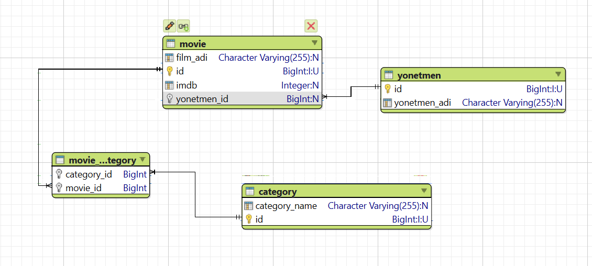

# MovieApp

**MovieApp** bir film yönetim sistemi olup, film, yönetmen ve kategori bilgilerini yönetmek için tasarlanmış bir Spring Boot uygulamasıdır. Bu proje, film verilerini kaydetmek, yönetmek ve ilgili kategorilerle ilişkilendirmek amacıyla geliştirilmiştir. Uygulama, film ve yönetmenler arasındaki ilişkileri yöneterek, belirli bir yönetmene ait filmleri listelemek ve yönetmek gibi işlevleri sağlar. Ayrıca, kullanıcıların belirli kategorilere göre film araması yapmasına olanak tanır.

## Proje Amacı

MovieApp, bir film veri tabanını kolayca yönetmek için esnek ve ölçeklenebilir bir çözüm sunar. Projenin temel amacı, film ve yönetmen bilgilerini etkin bir şekilde saklamak, bu bilgiler arasında anlamlı ilişkiler kurmak ve kullanıcıların bu verilere kolay erişimini sağlamaktır. Uygulama, film endüstrisi ile ilgili projelerde kullanılabilir ve farklı kategorilerdeki filmleri yönetmek isteyen herhangi bir kuruluş için idealdir. Ayrıca, bu proje, Spring Boot ile RESTful API geliştirme konusunda bir öğrenme aracı olarak da kullanılabilir.

## Proje Yapısı

- **Entityler:**
    - `Movie`: Filmleri temsil eder. Her film bir yönetmene bağlıdır ve birçok kategoriyle ilişkilidir.
    - `Yonetmen`: Yönetmenleri temsil eder. Her yönetmen birden fazla filme sahip olabilir.
    - `Category`: Film kategorilerini temsil eder. Her kategori birden fazla filme atanabilir.

- **DTO'lar:**
    - `requestDto`: İsteklerde kullanılan DTO'lar.
        - `movieSaveDto`: Yeni bir film kaydetmek için kullanılır.
        - `yonetmenSaveDto`: Yeni bir yönetmen kaydetmek için kullanılır.
        - `yonetmenUpdateDto`: Mevcut bir yönetmeni güncellemek için kullanılır.
        - `categorySaveDto`: Yeni bir kategori kaydetmek için kullanılır.
    - `responseDto`: Yanıtlarda kullanılan DTO'lar.
        - `movieByYonetmenResponseDto`: Yönetmen bilgisine göre film listesini döndürür.

- **Controllerlar:**
    - `MovieController`: Filmlerle ilgili işlemleri yönetir.
    - `YonetmenController`: Yönetmenlerle ilgili işlemleri yönetir.
    - `CategoryController`: Kategorilerle ilgili işlemleri yönetir.

- **Servisler:**
    - `movieService`: Film ile ilgili iş mantığını içerir.
    - `yonetmenService`: Yönetmen ile ilgili iş mantığını içerir.
    - `categoryService`: Kategori ile ilgili iş mantığını içerir.

- **Repositoryler:**
    - `movieRepository`: Film ile ilgili veri erişim katmanını sağlar.
    - `yonetmenRepository`: Yönetmen ile ilgili veri erişim katmanını sağlar.
    - `categoryRepository`: Kategori ile ilgili veri erişim katmanını sağlar.

- **Konfigürasyon:**
    - `ModelConfig`: DTO'ları entity'lere çevirmek için ModelMapper konfigürasyonunu sağlar.

## UML Diyagramı

Aşağıdaki UML diyagramı, proje içindeki entity'ler arasındaki ilişkileri göstermektedir:

## API Kullanımı

- **Film Kaydetme:**  
  `POST /movie/saveMovie`  
  Yeni bir film kaydeder.

- **Yönetmene Göre Filmleri Getir:**  
  `GET /movie/getMovieByYonetmenId`  
  Belirtilen yönetmen ID'sine göre filmleri getirir.

- **Film Silme:**  
  `DELETE /movie/deleteMovieId`  
  Belirtilen film ID'sine göre filmi siler.

- **Yönetmen Kaydetme:**  
  `POST /yonetmen/saveYonetmen`  
  Yeni bir yönetmen kaydeder.

- **Yönetmen Güncelleme:**  
  `PUT /yonetmen/updateYonetmen`  
  Mevcut bir yönetmeni günceller.

- **Kategori Kaydetme:**  
  `POST /category/saveCategory`  
  Yeni bir kategori kaydeder.

## Kullanılan Teknolojiler

- Spring Boot
- Spring Data JPA
- PostgreSQL
- ModelMapper
- Lombok
